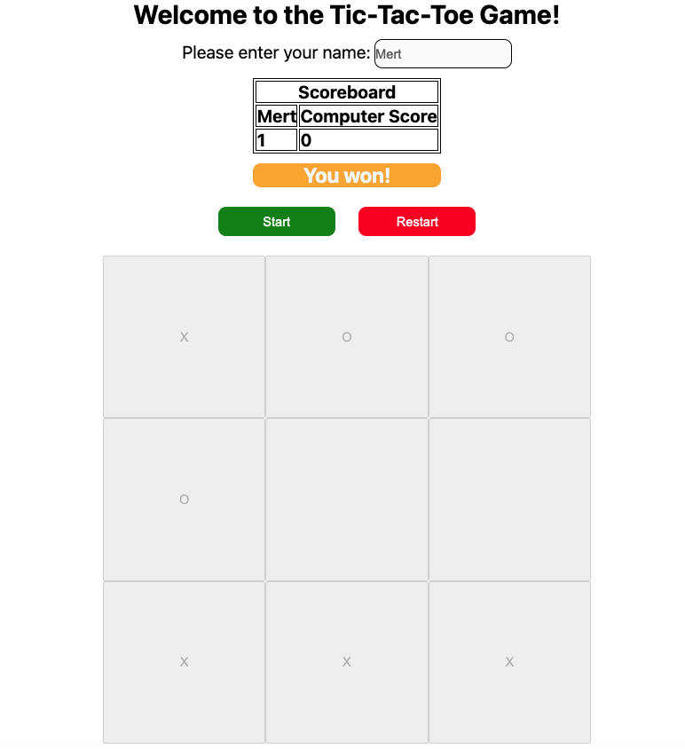

# 🎮 Tic-Tac-Toe

A vanilla JavaScript Tic-Tac-Toe game built as part of [The Odin Project](https://www.theodinproject.com/) curriculum, focused on practicing **factory functions**, the **module pattern**, and **ES6 modules**.

  

## 🔗 Live Preview

**[https://arifmertmisir.github.io/tic-tac-toe](https://arifmertmisir.github.io/tic-tac-toe)**

## 📖 About the Project

This project was built in three stages:

1. **Console version** — the game logic (players, board, win/tie detection) was first built and tested purely in the browser console, with no UI at all. This forced a clean separation between _game logic_ and _presentation_.
2. **DOM integration** — the same logic was then wired up to the DOM, adding a scoreboard, a customizable player name, start/restart controls, and win/tie messages.
3. **ES6 modules refactor** — the game logic was split into its own file (`tic-tac-toe.js`) and imported into the entry point (`playGame.js`) using native `import`/`export`.

The main learning goal wasn't the game itself, but practicing core JavaScript patterns:

- **Factory functions** — `createPlayer(name, preference)` returns a fresh player object (with its own private `score`) every time it's called, instead of using classes or `new`.
- **Module pattern (closures)** — the game controller (`playGame`) keeps state like `winner` and `filledPlaces` private inside its own scope, exposing only what's needed (`getWinner`) through a returned object.
- **ES6 modules** — game logic is exported from `tic-tac-toe.js` and explicitly imported where needed, instead of relying on global scope or a single script file.

## ✨ Features

- 🧑 Custom player name — enter your name and it replaces "Your Score" in the scoreboard
- 🖥️ Simple computer opponent — picks a random empty cell
- 🏆 Win detection — checks all 8 winning combinations (rows, columns, diagonals) after **every single move**
- 🤝 Tie detection — correctly distinguishes "board full" from "someone won on the last move"
- 📊 Persistent scoreboard — tracks wins across multiple rounds until reset
- 🔄 Restart button — clears the board and scores, ready for a new match
- 🚫 Invalid move protection — clicking an already-filled cell shows an alert instead of overwriting it

## 🛠️ Tech Stack

- HTML5
- CSS3
- Vanilla JavaScript (ES6+)
- Native ES6 Modules (`import` / `export`)

## 🧠 Key Concepts Practiced

| Concept                   | Where it shows up                                                                                              |
| ------------------------- | -------------------------------------------------------------------------------------------------------------- |
| Factory functions         | `createPlayer()` creates independent player objects with encapsulated `score`                                  |
| Module pattern / closures | `playGame()` wraps all game state and only exposes `getWinner`                                                 |
| ES6 modules               | `tic-tac-toe.js` exports reusable game helpers, `playGame.js` imports and orchestrates them                    |
| Closures                  | Private variables (`winner`, `filledPlaces`) stay accessible to inner functions without being exposed globally |
| Event delegation basics   | Each board cell has its own click listener that drives the whole turn cycle                                    |
| DOM manipulation          | Dynamically updating scoreboard, win/tie banner, and board visibility                                          |

**Arif Mert Mısır**
[GitHub](https://github.com/arifmertmisir)

---

_Part of [The Odin Project](https://www.theodinproject.com/) Full-Stack JavaScript curriculum._
